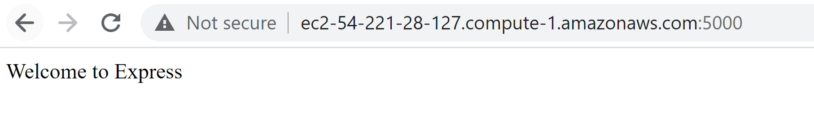
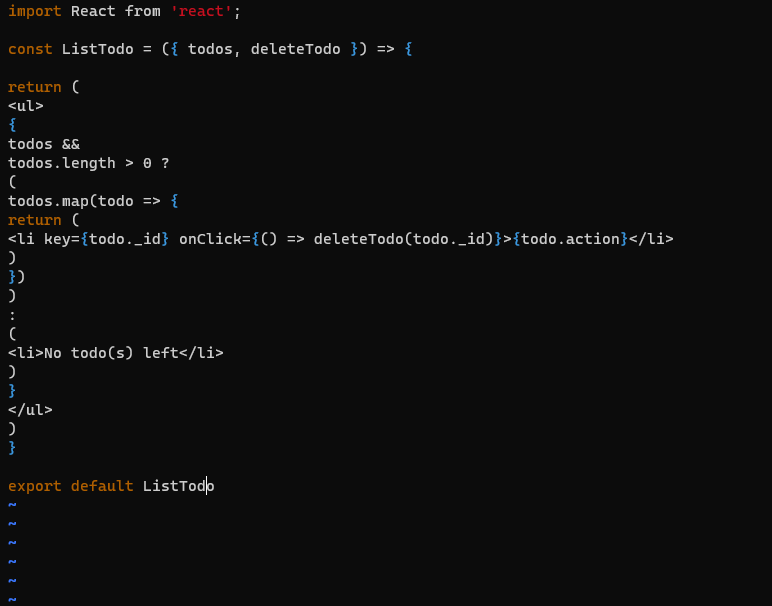

# Project 3
## Step 1: Backend Configuration
   1. Update and Upgrade Ubuntu with commands

   - *sudo apt update*
   - *sudo apt upgrade*

   2. Get the location of Node.js in Ubuntu repositories and install Node.js
    - *curl -fsSL https://deb.nodesource.com/setup_18.x | sudo -E bash - *
    
    - *sudo apt-get install -y nodejs*

   3. The Node.js installation command install both Node.js and NPM. To verify the instalation of both Node.js and NPM use the follwoing command
    - *node -v*
    - *npm -v*
    

### Application Code Setup
    
1. Creatye new Directory for the To-Do project

      - *mkdir Todo*

2. Make new changes inside the current Todo Directory and initialize the project to create the new project.jason file.

 - *cd Todo*
 - *npm.init*
 
 

 3. Confirm the newly created project.json file

  

### Install Expressjs

1. use the command to install Expressjs

- *npm install express*
2.  Create a file called "index.js", then use *ls* to confirm the installation.

 - *touch index.js*

3. Install dotenv using the command

- *npm install dotenv*

4. Open the index.js file and place the code as shown below

    

5. Verify that the server is working using the command

- *node index.js*

6. Verify the new Website
 - curl -s http://169.254.169.254/latest/meta-data/public-ipv4
 
 

 - http://54.221.127:5000
  

  ### Model

1. Installing the Mongodb database for the app
- *npm install mongoose* 
- create a new directory  "model"inside parent directory "Todo"
    - *mkdir model*
- inside the new directory "model" create a new file called "todo.js"
  

- Edit "todo.js" file as shown below

  

2. Open the "api.js file inside the "route" directory and input the provided script.

    

### Mongodb Database

1. create and new database called Monggodb
- 

2. Create the database

3. Create a new Network access to allow all network.
    

4. Create a new hidden file called "env" inside  "Todo" directory and add a collection string to access the database created. The Database access is place inside the hidden file ".env" to make it secured.

  

  - The collection string can be retrieved from the cloud Mongodb as shown below

    

    

5. Edit the initial created "index.js" file as replaced with the new script as shown below
   

6. Launch the server using 
    
    *node index.js*

    

### Testing Backend Code without Frontend using RESTful API

Install Postman to test the backend created even when the fronend is not available. Then perform the following
1.  Create a POST request to the *API* using the link *http://*ec2-44-202-166-238.compute-1.amazonaws.com:5000/api/todos*
  

- Set the Header and the body has shown below, then click *send*
  

- Click *Send* to test the backend created

 

2. Create a GET request from the API from the same link *http://*ec2-44-202-166-238.compute-1.amazonaws.com:5000/api/todos* t retreive the records from the To-do application from the backend.

 - Set the Header as shown below and click *send*

   
- Click *Send* to acccess the backend application To-do.
   

## STEP 2: FRONTEND CREATION
 We will create the Web client to connect witht the backend application via API.

 1. In the Todo directory run the command below, to create a new directory called **client * in *Todo* directory.
    
      *npx create-react-app client*
2. Running a React App

   - First install *concurrently* to run multiple commands at the same time on the same terminal
    *npm install concurrently --save-dev*

    - Then install *nodemon* for server running and monitoring.
     *npm install nodemon --save-dev*
    
    - Edit the *package.json* 
    

3. Configuration of Proxy in package.json
 - Navigate to *client*  using *cd client*
 - Open the *package.json* file using *vi package.json* 
 - Add the key value pair inside the *package.json* using

 *"proxy": //localhost:5000*
   

4. Run *npm run dev* inside the Todo directory.The result is below

   

5. Add port 3000 to the allowed port number
   

6. Launch the app using the public address with port 3000
   

 ### Creating your React Components
 1. Navigate into *client* directory, then into *src* directory. Inside the *src* directory create directory *components*
    
  
2. Navigate in the newly created directory and create  three files Input.js, ListTodo.js and Todo.js
 

3. Open the file *Input.js* and paste the provided script.
   

4. Install Axios insode the client directory using
   *npm install axios*

5. Navigate into *components* directory and paste the provided script into the *ListTodo.js* file.
   

6. Inside *Todo.js* file paste the script provided
   

7. Inside the *src* directory replace the content in *App.js* with the provided script.

  
  
8. Replace the script inside *App.css* file in *src* directory with the provided script.

   

9. Inside the *src* directory replace the script inside the *index.css with the provided script.

   

10. Back to the *Todo* directory and run *npm run dev*

    

11. Access the To-Do app vis the *localhost:3000*

    